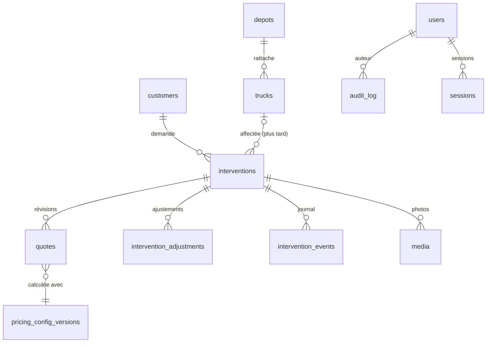

# 04 — Modèle de données

> Document de cadrage, version 0.1 du 03/10/2026. Champs principaux, à affiner en Phase 1.

## Conventions

- Identifiants `uuid`. `created_at` et `updated_at` en `timestamptz` : stockés en UTC, affichés à l'heure de Paris.
- Montants en **centimes** (`integer`, suffixe `_cents`). Prix du carburant en **millièmes d'euro par litre** (`_millis`). Pourcentages en **points de base** (`_bp`, 1 % = 100).
- Coordonnées `lat` / `lng` en `numeric(9,6)`.
- Valeurs énumérées : texte contrôlé par une contrainte (ex. statut).
- `jsonb` lorsqu'une structure souple est utile (réglages, photographies), toujours validé par un schéma versionné.
- Noms techniques en anglais. L'admin n'affiche que des libellés français.

## Vue d'ensemble

## Correspondance avec le cahier des charges

| Nom du cahier des charges | Où c'est stocké |
|---|---|
| `companySettings` | `settings` section `company` |
| `pricingSettings`, `minimumPrice` | `settings` section `pricing_policy` |
| `fuelSettings` | `settings` section `fuel`, consommation dans `trucks` |
| `scheduleSettings` | `pricing_rules` (plages horaires, jours, fériés) et `public_holidays` |
| `vehicleRules` | `vehicle_categories` (ce que voit le client) et `pricing_rules` (ce que ça coûte) |
| `serviceRules` | `situations` et `pricing_rules` |
| `depotAddress` | `depots` (dépôt par défaut) |

## 1. Entreprise et paramètres

### `settings`
Réglages regroupés par section, validés par le registre des réglages.

| Champ | Type | Description |
|---|---|---|
| `key` | text, clé | `company`, `pricing_policy`, `fuel`, `estimate`, `zone`, `public_site`, `notifications`, `integrations` |
| `value` | jsonb | contenu de la section |
| `schema_version` | int | version du format |
| `updated_at`, `updated_by` | | |

Exemples de contenu :

- `company` : nom affiché, téléphone, WhatsApp, email, horaires ou disponibilité 24/7, informations légales ;
- `pricing_policy` : prix minimum, arrondi, marge, TVA, cumul des majorations, heure de référence ;
- `fuel` : mode automatique ou manuel, prix manuel, source, fréquence, ancienneté maximale, bornes, indexation ;
- `estimate` : estimation en ligne activée, durée de validité, affichage de l'heure d'arrivée ;
- `zone` : distances maximales, zones réglementées et messages au client.

### `depots`
| Champ | Description |
|---|---|
| `id`, `name` | ex. « Dépôt principal » |
| `address_label`, `street`, `postcode`, `city` | adresse |
| `lat`, `lng`, `geocoded_at`, `geocoding_source` | position confirmée sur la carte |
| `is_default`, `active` | dépôt de référence des calculs |

### `trucks`
Une seule ligne aujourd'hui ; plusieurs dépanneuses plus tard sans refonte.

| Champ | Description |
|---|---|
| `id`, `name`, `plate` | nom, immatriculation |
| `body_type` | plateau, plateau avec treuil… |
| `fuel_type` | gazole… |
| `consumption_empty_l100`, `consumption_loaded_l100` | consommation à vide et en charge (L/100 km) |
| `gross_weight_kg`, `max_payload_kg`, `height_cm` | PTAC, charge utile, hauteur (parkings) |
| `home_depot_id`, `active` | |

## 2. Tarification

### `pricing_rules`
Toutes les règles activables. Modèle détaillé dans [03 — Moteur tarifaire](03-moteur-tarifaire.md), §5.

| Champ | Description |
|---|---|
| `id`, `code` | identifiant et clé interne stable (ex. `calendar.sunday`) |
| `label`, `help` | nom et aide en français |
| `category`, `ledger` | catégorie ; compte (prix client ou coût interne) |
| `enabled`, `effect` | activée ; supplément ou remise |
| `calculation` | jsonb : fixe, pourcentage (et sa base), €/km (trajets, km offerts), €/heure, carburant |
| `conditions` | jsonb : liste de conditions de la liste fermée |
| `stacking_group`, `priority` | groupe de cumul ; ordre dans l'étape |
| `client_visible`, `client_label` | affichage au client |
| `system` | règle fournie : désactivable mais pas supprimable |
| `created_at`, `updated_at`, `updated_by` | |

### `vehicle_categories`
Ce que le client peut choisir. Le prix est porté par les règles associées.

| Champ | Description |
|---|---|
| `code`, `label`, `icon`, `sort_order` | |
| `client_visible` | proposé au client ou non |
| `acceptance` | `accepted`, `on_request` (pas de prix automatique), `refused` |
| `active` | |

### `situations`
Problèmes et particularités (non roulant, batterie, treuillage…).

| Champ | Description |
|---|---|
| `code`, `label`, `client_label`, `icon`, `sort_order` | |
| `group` | « problème » ou « particularité » |
| `client_visible` | proposé au client ou réservé à l'admin |
| `implies_non_rolling`, `requires_tow` | aident à simplifier les questions posées au client |
| `active` | |

### `public_holidays`
| Champ | Description |
|---|---|
| `date`, `label` | |
| `source` | `computed` (calculé) ou `custom` (ajouté par l'admin) |
| `enabled` | un férié peut être ignoré |

### `pricing_config_versions`
Photographies non modifiables de l'ensemble des tarifs.

| Champ | Description |
|---|---|
| `id`, `version_number` | numéro croissant |
| `config` | jsonb : copie complète de tout ce que lit le moteur |
| `config_hash` | empreinte, pour détecter les doublons |
| `change_summary` | résumé lisible des changements |
| `created_at`, `created_by` | |

### `reference_trips`
Trajets types utilisés pour l'aperçu d'impact d'une modification de tarif.

| Champ | Description |
|---|---|
| `id`, `name` | ex. « Batterie à Drancy » |
| `input` | jsonb : entrées du simulateur |
| `sort_order`, `active` | |

### `audit_log`
Journal de toutes les modifications importantes.

| Champ | Description |
|---|---|
| `id`, `at`, `user_id` | quand, qui |
| `entity_type`, `entity_id` | quoi : règle, réglage, dépôt, intervention… |
| `field`, `label_fr` | champ technique et libellé affiché |
| `old_value`, `new_value` | valeurs brutes |
| `display_old`, `display_new` | valeurs lisibles : « 45 € » → « 50 € » |
| `reason` | motif facultatif |
| `config_version_id` | version de tarifs créée par ce changement |

## 3. Carburant

### `fuel_prices`
| Champ | Description |
|---|---|
| `id`, `observed_at`, `fetched_at` | date de la donnée, date de récupération |
| `fuel_type` | gazole… |
| `price_ttc_millis` | ex. 1829 pour 1,829 €/L |
| `source`, `scope` | source ; périmètre : station précise, ou médiane de N stations dans un rayon |
| `sample_size` | nombre de stations prises en compte |
| `status`, `rejection_reason` | `accepted` ou `rejected` (contrôle de vraisemblance) |

## 4. Clients et interventions

### `customers`
| Champ | Description |
|---|---|
| `id`, `name`, `phone_e164`, `email` | |
| `notes`, `tags` | ex. « client régulier », « professionnel » |
| `created_at` | |

### `interventions`
| Champ | Description |
|---|---|
| `id`, `reference` | ex. `RNB-2026-00042` |
| `status`, `source` | statut ; origine : site, téléphone, WhatsApp, admin |
| `customer_id`, `contact_name`, `contact_phone` | coordonnées figées au moment de la demande |
| `pickup_address`, `pickup_lat`, `pickup_lng` | prise en charge |
| `pickup_after_regulated_road`, `handover_note` | relais après autoroute, sortie indiquée |
| `dropoff_kind`, `dropoff_address`, `dropoff_lat`, `dropoff_lng` | destination, ou « sur place » |
| `vehicle_category`, `vehicle_brand`, `vehicle_model`, `vehicle_plate`, `vehicle_rolling` | véhicule |
| `situations` | text[] : codes |
| `client_comment`, `internal_notes` | |
| `requested_for` | vide = dès que possible |
| `current_quote_id` | estimation en vigueur |
| `confirmed_price_cents`, `confirmed_at`, `confirmed_by` | prix confirmé |
| `truck_id`, `driver_id` | vides aujourd'hui, prévus pour la flotte |
| `accepted_at`, `en_route_at`, `arrived_at`, `loaded_at`, `transport_started_at`, `completed_at`, `cancelled_at` | horodatage de chaque étape |
| `cancel_reason` | |
| `created_at`, `updated_at` | |

### `quotes`
Estimations et leurs révisions. Chaque ligne est une photographie.

| Champ | Description |
|---|---|
| `id`, `intervention_id`, `revision` | `intervention_id` vide pour une estimation sans demande |
| `source` | site, simulateur, appel, recalcul |
| `status` | `estimated`, `used`, `superseded`, `expired` |
| `input`, `context`, `result` | jsonb : entrées, contexte, résultat complet |
| `config_version_id`, `engine_version` | tarifs et moteur utilisés |
| `price_ttc_cents`, `price_ht_cents`, `price_hidden` | prix (ou prix non affiché) |
| `internal_cost_cents`, `fuel_cost_cents`, `margin_cents` | pour les statistiques |
| `km_empty_out`, `km_loaded`, `km_empty_back`, `km_total` | kilomètres |
| `warnings` | text[] |
| `expires_at`, `created_at`, `created_by` | `created_by` vide si c'est le client |

### `intervention_adjustments`
| Champ | Description |
|---|---|
| `id`, `intervention_id`, `quote_id` | |
| `effect`, `mode`, `value` | supplément ou remise ; € ou % ; valeur |
| `reason` | motif obligatoire |
| `created_by`, `created_at` | |

### `intervention_events`
Journal de l'intervention.

| Champ | Description |
|---|---|
| `id`, `intervention_id`, `at`, `by` | |
| `type` | changement de statut, appel, note, changement de prix, photo, notification |
| `from_status`, `to_status` | pour les changements de statut |
| `data` | jsonb : détails |

### `media`
| Champ | Description |
|---|---|
| `id`, `intervention_id` | |
| `kind` | photo client, avant, après, signature, document |
| `storage_key`, `mime_type`, `size_bytes`, `width`, `height` | fichier privé |
| `metadata_stripped` | métadonnées supprimées (dont la position GPS) |
| `uploaded_by`, `created_at` | client ou admin |

## 5. Utilisateurs et sécurité

### `users`
| Champ | Description |
|---|---|
| `id`, `name`, `email` | |
| `password_hash` | haché (argon2id ou scrypt), jamais le mot de passe |
| `role` | `admin` aujourd'hui ; plus tard `dispatcher`, `driver` |
| `active`, `last_login_at` | |
| `two_factor_enabled` | double vérification (option) |

### `sessions`
| Champ | Description |
|---|---|
| `id` | empreinte du jeton, jamais le jeton lui-même |
| `user_id`, `expires_at`, `created_at` | |
| `ip`, `user_agent` | |

### `login_attempts`
Identifiant, adresse IP, date, réussite : sert à limiter les tentatives.

### `push_subscriptions`
Téléphones de l'admin abonnés aux notifications : `user_id`, `endpoint`, clés, nom de l'appareil.

## 6. Système

| Table | Rôle |
|---|---|
| `notifications` | file d'envoi : canal, destinataire, modèle, contenu, statut, tentatives, erreur, date d'envoi, intervention liée |
| `route_cache` | distances déjà calculées : départ, arrivée, fournisseur, profil, distance, durée, date |
| `provider_status` | santé des services externes : dernier succès, dernier échec, erreur, échecs consécutifs |
| `service_areas` | pages « zones d'intervention » : ville, code postal, texte, activée |

## 7. Tables prévues plus tard

`drivers`, `truck_positions`, `payments`, `invoices` (via une plateforme agréée), `fuel_fills` (pleins réels), `maintenance_events`, `social_templates`.
